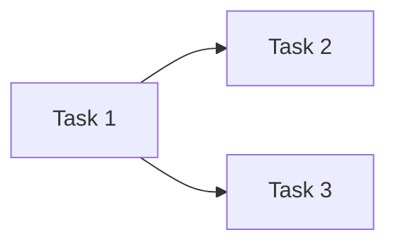

# /pm:gen-tasks-for-story - Generate Tasks from Story

Generate developer tasks (subtasks) from an existing story in your issue tracker.

## Arguments

- `$ARGUMENTS`:
  - **story_key** - Story key from your tracker (e.g., PROJ-123)
  - **context** (optional) - Additional context for task generation

## Usage

```bash
/pm:gen-tasks-for-story PROJ-123
/pm:gen-tasks-for-story PROJ-123 "Focus on API performance"
```

## Output

Creates: `.claude/jira/{story_key}-tasks.md`

## Instructions

### 1. Show Start Banner

```
═══════════════════════════════════════════════════
📋 PM: Generate Tasks for Story
   └─ Story: {story_key}
   └─ Context: {context or "None"}
═══════════════════════════════════════════════════
```

### 2. Create Output Directory

```bash
mkdir -p .claude/jira
```

### 3. Fetch Story Details

**If using Jira MCP** (mcp__claude_ai_Atlassian tools available):

```
Use Task tool with subagent_type: "jira", model: "haiku"

Task: Fetch the story and return its details.

Story Key: {story_key}

Steps:
1. Use mcp__claude_ai_Atlassian__getJiraIssue to fetch the story
2. Return: summary, description, acceptance criteria, labels, priority, epic link
```

**If no tracker integration**: Ask the user to paste the story description.

### 4. Load Task Templates Skill (if configured)

```
Read .claude/skills/pm/{YOUR_TEMPLATES_SKILL}/SKILL.md
```

### 5. Analyze Story for Task Breakdown

Break down the story into technical tasks:

**Frontend Tasks** (if applicable):
- Component/view implementation
- State management and data flow
- API integration layer
- Form validation and UX
- Tests

**Backend Tasks** (if applicable):
- Service/business logic layer
- API endpoint / controller
- Data access / repository
- Validation logic
- Unit tests

**Guidelines:**
- Each task = 0.5–2 days of focused work
- Tasks should be independently completable
- Separate frontend and backend where both are needed
- Include testing tasks explicitly

### 6. Generate Tasks

For each task use this template:

```markdown
## Task {n}: [{Frontend|Backend|Testing|Database}] {Title}

**LINK TO DESIGN:**
See parent story: {story_key}

---

**DESCRIPTION:**
This task implements the {component/service/endpoint} for {feature context}.
{Brief description of what needs to be built and its states.}

**ACCEPTANCE CRITERIA:**
- {Specific, testable criterion}
  - SCENARIO:
    GIVEN {precondition}
    WHEN {action}
    THEN {expected result}
- {Empty/error state criterion}
  - SCENARIO:
    GIVEN {precondition}
    WHEN {action}
    THEN {expected result}

---

**Metadata:**
- Parent: {story_key}
- Type: {Frontend | Backend | Testing | Database}
- Effort: {S | M | L}
- Dependencies: {task numbers or "None"}
```

### 7. Save Output

Write to `.claude/jira/{story_key}-tasks.md`:

```markdown
# Tasks for: {story_key}

**Story:** {story_summary}
**Generated:** {YYYY-MM-DD HH:MM}
**Context:** {additional context or "N/A"}

---

{generated tasks}

---

## Task Dependencies



## Summary

| Type     | Count | Total Effort |
|----------|-------|--------------|
| Frontend | {N}   | {effort}     |
| Backend  | {N}   | {effort}     |
| Testing  | {N}   | {effort}     |
```

### 8. Show Completion Banner

```
═══════════════════════════════════════════════════
✅ Tasks Generated
   └─ File: .claude/jira/{story_key}-tasks.md
   └─ Tasks: {N} tasks created
   └─ Parent Story: {story_key}
═══════════════════════════════════════════════════

Next Steps:
1. Review: .claude/jira/{story_key}-tasks.md
2. Configure: /pm:prepare .claude/jira/{story_key}-tasks.md
3. Push: /pm:push .claude/jira-ready/{file}.json

═══════════════════════════════════════════════════
```

## Task Sizing Guide

| Effort | Duration   | Description                           |
|--------|------------|---------------------------------------|
| **S**  | 0.5–1 day  | Single component, straightforward     |
| **M**  | 1–2 days   | Multiple components, moderate logic   |
| **L**  | 2–3 days   | Complex feature, requires research    |

## Workflow Position

```
Story in tracker  →  /pm:gen-tasks-for-story  →  /pm:prepare  →  /pm:push
                               ↑
                           YOU ARE HERE
```

## Related

- **Agent**: `jira` - Fetch story from Jira (requires Jira MCP)
- **Command**: `/pm:gen-tasks-for-stories` - Batch generate from a stories file
- **Command**: `/pm:prepare` - Configure tracker fields before pushing
